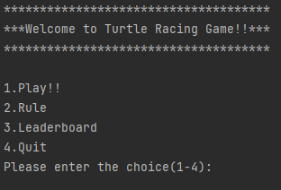
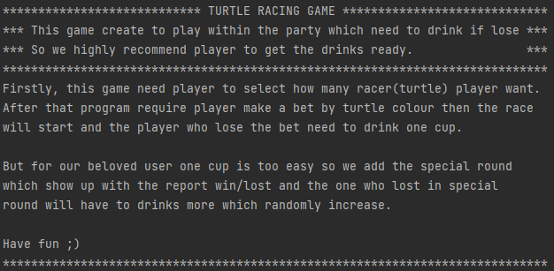
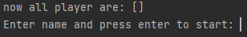
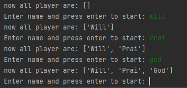
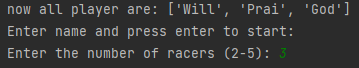
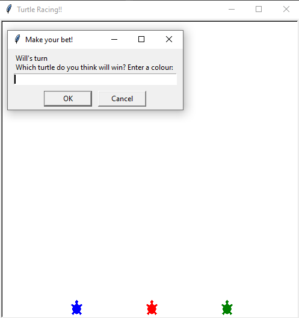
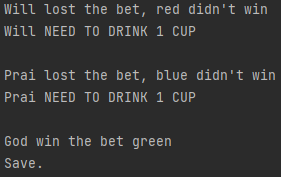
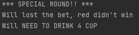
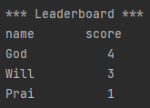
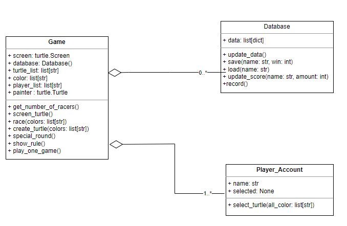

# TurtleRacingGame!!
This project was made for concluding and apply all the lesson in 01219114 Computer Programming I course.
Which has an inspiration from horse racing game that require a money to place a bet
but, we are a college how we can get that money?.
So why don't we drink it instead 🍻.

---

## 🍻 Overview and Features🍻

This program includes four menu which user can choose.

### 🍻Rule🍻
If user selected rule it will show rule of this game

### 🍻Play🍻
If user select play the program will be like this which require user to insert the name.

<b> \*The name can insert more than one name\* </b>

After user pressing enter the program will require user to select how many racer the user want.

Then user need to pick a turtle colour to make a bet and the race will begin.

After that the program will report who win/lost

But!! if the player lucky enough the special round will come up 
in report and randomly increase amount of the cup 
which player need to drink.

### 🍻Leaderboard🍻
If user selected Leaderboard it will show all score of player.

---

## 🍻Requirement🍻

This is requirement for this project

### Python version

* [Python 3.8](https://www.python.org/downloads/)

### Module
* [`Turtle`](https://docs.python.org/3/library/turtle.html), which is used for the graphical part.
* [`Time`](https://docs.python.org/3/library/time.html?highlight=sleep#time.sleep), which is used for count and delay graphic.
* [`csv`](https://docs.python.org/3/library/csv.html), which is use for read and write file.

---

## 🍻Program Design🍻

This program consists of three classes.
* `Database` : Used for record name and win of player in csv file
* `Player_Account` : Represent the name in name_list and make a bet with turtle colour
* `Game` : Used for create all the graphical and method of the game.

🍻UML Class Diagram of this project🍻

---

## 🍻Code Structure🍻

This program consists of four python file and one csv file for record player data.

* [database.py](database.py): This file contains the `Database` class.
* [Player_Account.py](Player_Account.py): This file contains the `Player_Account` class.
* [Turtle.py](Turtle.py): This file contains the `Game` class.
* [data.csv](data.csv): CSV file for collecting data.
* [main.py](main.py): This file used to run entire thing.

---

### 🍻Hope you have a great time, Have fun!!🍻

---